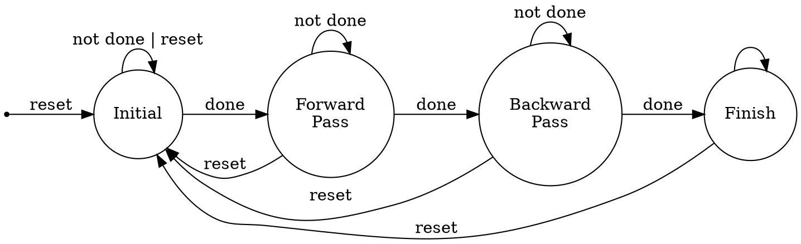

## 設計概念




1. initialize: (init.v)
    
    0. initial: sti_addr=0 (addr send to ROM), buffer_counter=0, res_addr=0 (addr send to RAM)。 state: initialize
    1. (sti_rd=1)將16 bits 的資料由ROM讀進來。state: indicate_ROM
    2. (sti_rd=0)儲存由ROM傳進來的資料，buffer[0:15]。state: load_from_ROM
    3. (res_wr=1)傳送資料給RAM,res_do={7'b0, buffer[counter]}, res_addr_nstate+1 ,buffer_counter=15?是: step 4；否: buffer_counter+1，重複step 3。state: send_to_RAM
    4. (res_wr=0)，sti_addr=1023?是: step 5；否: sti_addr+1，buffer_counter=0，step 1。state: checkif_done
    5. initialize done! state: initial_done


2. forward pass: (fp.v)
    
    0. initial_done? Yes:設RAM_addr=129 (題目說明圖形四周都是0，而0不需做計算，因此從第1排的第一個開始(註: 開頭是第0排第0個)，也就是128*1+1)；No: Step 0。state: init
    1. (res_rd=1) 傳送RAM_addr給RAM(res_addr=RAM_addr)。state: send_target_addr
    2. (res_rd=0) 檢查來自RAM的資料是否為0，若是0，則跳到第8步；不是0則繼續step 2。state: check_target
    3. (res_rd=1)傳送NW(res_addr=RAM_addr-128-1)給RAM。state: send_NW
    4. (res_rd=1)傳送N(res_addr=RAM_addr-128)給RAM，將收到的值給予NW[7:0]。state: send_N_load_NW
    5. (res_rd=1)傳送NE(res_addr=RAM_addr-128+1)給RAM，將收到的值給予N[7:0]。state: send_NE_load_N
    6. (res_rd=1)傳送W(res_addr=RAM_addr-1)給RAM，將收到的值給予NE[7:0]。state: send_W_load_NE
    7. (res_rd=0, res_wr=1) 找出NW, N, NE, W(這週期收到的值)中最小值，將這個值+1後寫回RAM, res_addr=RAM_addr。state: load_W_find_min
    8. (res_rd=0, res_wr=0) 檢查RAM_addr=128*126+126?，若是，跳到第9步；否，(RAM_addr-127)%128=0?是，RAM_addr+3, go to step 1；否，RAM_addr+1, go to step 1。 state: check_RAM_addr
    9. forward_pass_done，forward pass完成, state: done  

3. backward pass: (bp.v)
    
    0. forward_pass_done? yes: RAM_addr=128*126+126，step 1 ； no: step 0。state: init
    1. (res_rd=1) 傳送res_addr給RAM，target=0。state:send_target_addr
    2. (res_rd=0) 檢查來自RAM的資料是否為0，target=res_di，若是0，則跳到step 7；不是0，繼續 step 3。state: check_target
    3. (res_rd=1) 傳送E(res_addr=RAM_addr+1)給RAM。state: send_E
    4. (res_rd=1) 傳送SW(res_addr=RAM_addr+127)給RAM，將收到的值給E[7:0]。state: send_SW_load_E
    5. (res_rd=1) 傳送S(res_addr=RAM_addr+128)給RAM，將收到的值給SW[7:0]。state: send_S_load_SW
    6. (res_rd=1) 傳送SE(res_addr=RAM_addr+129)給RAM，將收到的值給S[7:0]。state: send_SE_load_S
    7. (res_rd=0, res_wr=1) 找出E, SW, S, SE(這週期收到的值)，中最小者，將這個值+1後與target比較，把這次比較中較小的值寫回RAM，(res_addr=RAM_addr)。state: load_SE_write_back
    8. (res_rd=0, res_wr=0)檢查RAM_addr=129? 是，跳到第9步；否，(RAM_addr-1)%128=0?是，RAM_addr-3, go to step 1；否，RAM_addr-1, go to step 1。 state: check_RAM_addr
    9. backward_done，trigger DT的DONE，全部完成。state: DONE

註: 為了減少晶片面積的浪費，在forward pass/backward pass loading每一個pixel時，就會與上一個值比較，若新進來的值較小則保留，這樣就可以減少所需要的buffer數，最後將值寫回RAM時也不必再耗費3個buffer來比較數值

## Gate level Simulation 心得
在Gate level Simulation時，使用design compiler產出gate level netlist的.v檔後，用ncverilog驗證時整個結果都有問題（輸出位置沒對上、該作動的信號沒變化等），持續比對waveform，最後將部分信號置於always@( * )之下，跟輸出地址有關的放在always@(posedge clk)之下，才順利完成gate level simulation

## 指令
先source verdi, 再source Incisive(irun, ncverilog)  
RTL Simulation(dump FSDB waveform file):   
```
irun testfixture.v DT.v init.v fp.v bp.v +define+TB1 +define+FSDB +access+r
```
Gate Level Simulation:  
```
irun testfixture.v DT_syn.v -v tsmc13_neg.v +define+SDF +define+TB1 +define+FSDB +access+r
```  

已通過 TB1, TB2 的 RTL Simulation、Gate Level Simulation  
Time (TB1/TB2) = 1842610 / 1608610 NS，Area= 11038 (競賽要求A級 Time < 1920000 NS，Area < 12500)


## 使用 IC compiler


## system C
DT.h 與 DT.cpp 為主要的設計檔  
執行:
```
make && ./DT
```
